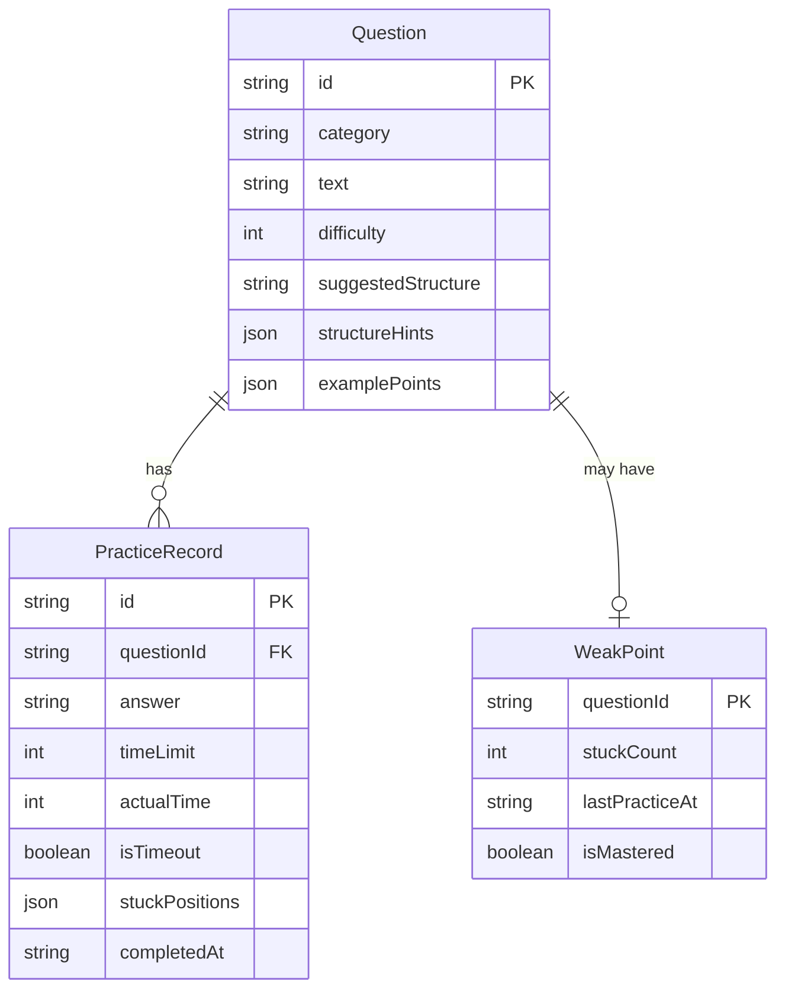

## 1. 架构设计

```mermaid
flowchart TB
    subgraph "前端层"
        "React 18 应用"
        "TailwindCSS 样式"
        "Zustand 状态管理"
    end
    subgraph "数据层"
        "localStorage 持久化"
        "Mock 题库数据"
    end
    "React 18 应用" --> "Zustand 状态管理"
    "Zustand 状态管理" --> "localStorage 持久化"
    "React 18 应用" --> "Mock 题库数据"
```

纯前端应用，无需后端服务。所有练习记录和弱点数据通过 localStorage 本地持久化，题库数据以 JSON 形式内嵌于前端代码中。

## 2. 技术说明

- **前端**：React@18 + TailwindCSS@3 + Vite
- **初始化工具**：Vite (create-vite)
- **状态管理**：Zustand（轻量级，支持持久化中间件）
- **后端**：无
- **数据库**：无（localStorage + 内存数据）
- **动画库**：framer-motion（倒计时动画、页面切换、卡片交互）

## 3. 路由定义

| 路由 | 用途 |
|------|------|
| / | 拆弹训练场 - 主页面，包含问题抽取、倒计时、结构提示、作答区 |
| /review | 弱点复盘台 - 卡壳记录、强化练习、进度看板 |
| /bank | 题库弹药库 - 分类浏览、搜索筛选、问题详情 |

## 4. API 定义

无后端 API，所有数据为本地 Mock 数据和 localStorage 读写。

### 4.1 数据接口定义

```typescript
interface Question {
  id: string
  category: 'self-intro' | 'project' | 'conflict' | 'resignation'
  text: string
  difficulty: 1 | 2 | 3
  suggestedStructure: 'STAR' | 'compare' | 'conclusion-first'
  structureHints: string[]
  examplePoints: string[]
}

interface PracticeRecord {
  id: string
  questionId: string
  answer: string
  timeLimit: 30 | 60 | 90
  actualTime: number
  isTimeout: boolean
  stuckPositions: number[]
  completedAt: string
}

interface WeakPoint {
  questionId: string
  stuckCount: number
  lastPracticeAt: string
  isMastered: boolean
}

interface PracticeStats {
  totalPractices: number
  categoryStats: Record<string, { count: number; stuckRate: number }>
  streakDays: number
}
```

## 5. 服务端架构图

不适用（纯前端应用）

## 6. 数据模型

### 6.1 数据模型定义



### 6.2 数据定义

题库数据以 TypeScript 常量形式内嵌，每个分类预置 8-12 道高频面试题。练习记录和弱点数据通过 Zustand persist 中间件自动同步至 localStorage。

### 6.3 题库分类与结构映射

| 分类 | 分类标识 | 推荐结构 | 说明 |
|------|----------|----------|------|
| 自我介绍 | self-intro | 结论前置 | 先亮核心标签，再分层展开 |
| 项目经历 | project | STAR | 情境-任务-行动-结果 |
| 冲突处理 | conflict | STAR | 重点在行动和结果 |
| 离职原因 | resignation | 对比法 | 过去 vs 期望，正面表达 |
